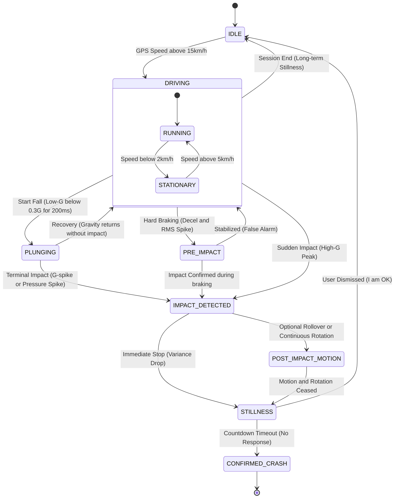

# AGENTS.md (v21.0 – Fixed Mermaid Syntax & Plunge Sequence)

This document defines **non-negotiable** coding, design, and behavior rules for the **Watch² Out** project.
All generated code must be safe, deterministic, and production-ready for a safety‑critical Wear OS application.

## 1. Project Overview & Multi-Module Structure

**Goal**
Develop a safety-critical accident detection system with a clear separation between the Wear OS app and the Mobile companion app.

**Enforced Project Structure**
AI MUST strictly separate code into these two independent modules. Cross-contamination of UI libraries is a hard failure.

1. **`:wear` (Wear OS Sentinel):** Real-time sensing, dynamic circular buffering, local fallback (SMS/Email/Call).
2. **`:app` (Mobile Companion):** Configuration Hub, primary emergency relay (SMS/Email/Call), telemetry viewer, high-res dashboard, Log full live data during Simulation On.

## 2. Technical Stack & Versions

**Target Versions**

* **`:wear`:** `minSdk 30` (Wear OS 3.0), `targetSdk 34`.
* **`:app`:** `minSdk 26` (Android 8.0), `targetSdk 34`.

**Key Dependencies**

* **Shared:** Kotlin Coroutines, Serialization (JSON), DataStore, `play-services-wearable`.
* **`:wear` Only:** `androidx.wear.compose`, `androidx.health.services`.
* **`:app` Only:** `androidx.compose.material3`, `MPAndroidChart`.

## 3. UI/UX Hierarchy & Dashboard

### 3.1 Wear OS UI (`:wear`)

* **Main Screen:** Large **START/STOP** toggle (Center), Dashboard & Settings buttons (Bottom).
* **Dashboard Screen:** Two-Bar Gauge.
* Bar 1: Previous cycle Max G.
* Bar 2: Current cycle Max G.

* **Complication:** Shield (Monitoring) / Lightning (Accident) / Broken Shield (Error).

### 3.2 Mobile UI (`:app`)

* **Dashboard:** Full-screen real-time line chart (Accel X/Y/Z, Magnitude, Threshold line).
* **Settings:** Text inputs for Emergency Contacts (Phone, Email, Webhook), Sampling Rate selection, Threshold tuning.
* **Simulation:** Manual triggers for Test Crash/Fall (Explicitly visible in settings).

## 4. Communication Protocol (Conditional Streaming)

### 4.1 Telemetry (Critical) - "Store-and-Forward"

* **Scenario:** Accident detected (`TRIGGERED`).
* **Logic:** Send JSON immediately.
* **Offline Resilience:** If disconnected, save JSON to `:wear` internal storage (`/files/pending/`). Strictly retry on reconnection (`onCapabilityChanged`).

### 4.2 Live Dashboard (Ephemeral) - "Drop-on-Fail"

* **Trigger:** Mobile app sends `/dashboard/start`.
* **Action:** Watch streams downsampled data (10Hz) only while `NodeClient` is connected.
* **Failure:** If disconnected, **DROP** data packets immediately. Do not buffer or save.

## 5. Detection Strategy & Detection Engines

### 5.1 Sampling Rate & Sensor Logic

* **Options:** 50ms (20Hz), 100ms, 200ms, 300ms, 500ms.
* **Implementation:** Convert to microseconds for `SensorManager`. Re-register listeners on change.

### 5.2 Dynamic Circular Buffering (EDR)

The `DataLogger` must capture the context before the accident.

* **Columns (12 floats):** Accel(3), Gyro(3), Pressure(1), Rotation(4), Audio_Status(1).
* **Capacity:** Fixed **10 seconds** of history.
* **Resizing:** Recalculate `FloatArray` size when sampling rate changes: `(10s * 1000) / rate_ms`.

### 5.3 Vehicle Crash Inference State Machine (FSM)

The system uses a Finite State Machine to track the context of a vehicle session and ensure flexible transition between states.

#### 5.3.1 FSM-Based State Transition Logic
* **DRIVING:** Context active even when GPS speed is 0 (Stationary) to detect rear-end collisions.
* **PLUNGING:** Transitional state for free-fall. Monitoring for terminal impact or pressure spike.
* **IMPACT_DETECTED:** Triggered by High-G OR [Low-G -> Moderate-G] sequence. Immediately freezes the EDR buffer.
* **STILLNESS:** Verification phase. Requires minimal sensor variance for a set duration.

### 5.4 Multi-Factor Scoring Algorithm (Classification)

When the FSM enters `IMPACT_DETECTED`, the system applies a weighted scoring algorithm to classify the accident type.

#### 5.4.1 Classification Factors
1. **Longitudinal Force (Jerk):** Delta-G on the Y-axis (forward/backward).
2. **Lateral Force:** Delta-G on the X-axis (left/right).
3. **Rotational Magnitude:** Accumulated degrees from the Gyroscope (Roll/Pitch).
4. **Gravity Vector Shift:** Change in resting gravity direction post-impact (Rollover check).
5. **Atmospheric Variance:** Rapid barometric pressure change (Altitude drop).

#### 5.4.2 Scenario Classification Signatures
* **Frontal Collision:** High negative Jerk (Y-axis) + High Deceleration.
* **Rear-end Collision:** High positive Jerk (Y-axis) + Rapid Pitch axis recoil (above 120 deg/sec).
* **Side Collision:** High-G peak on the X-axis.
* **Rollover:** Sustained rotation (above 180 deg) + Inverted Gravity Vector.
* **Run-off-road / Plunge (Fall):** Sequence of [Low-G Window] followed by [Terminal Impact (above 2.0G)] and/or [Pressure Increase].

### 5.5 Human Fall Engine (Low-G)
* **Focus:** Gravity-induced falls and vertical drops.
* **Multi-Stage Scoring:**
   * **Stage 1 (0-30%):** Weightless Window (below 0.3G for 100ms).
   * **Stage 2 (31-70%):** Impact Peak (above 2.5G).
   * **Stage 3 (71-90%):** Orientation Change (Z-axis rotation indicating horizontal posture).
   * **Stage 4 (91-100%):** Post-Impact Stillness.

## 6. Emergency & Evidence Protocol

### 6.1 Audio Evidence (Post-Event Only)

* **Trigger:** Starts ONLY on `TRIGGERED` (Real events only).
* **Simulation:** **Strictly DISABLED** during simulation mode to save resources.
* **Duration:** 10 seconds post-impact.
* **Privacy:** If user cancels alert ("I'M OK"), the audio file MUST be deleted immediately.

### 6.2 Dual-Path Dispatch

1. **Path A (Relay):** Watch -> Phone (JSON/Audio). Phone sends SMS/Email.
2. **Path B (Standalone):** If Relay fails & `useWatchCellular` is ON, Watch sends SMS directly.

## 7. Incident Lifecycle (State Machine)

1. **`MONITORING`**: Sensors ON. Ring Buffer active. Mic OFF.
2. **`TRIGGERED`**: Threshold crossed. **Freeze Ring Buffer**. Start 10s Audio (if real).
3. **`PRE_ALERT`**: Countdown UI (15-30s). Max Haptics.
4. **`DISPATCHING`**: Acquire GPS. Compile Telemetry JSON. Dispatch via `AlertDispatcher`.
5. **`CONFIRMED`**: UI shows "Help Requested". Revert Complication only after user dismissal.

## 8. Core Coding Standards (MISRA-Adapted)

* **Safety:** No `!!` or `lateinit` in logic/services. Use explicit null checks.
* **Memory:** No object allocation inside `onSensorChanged`. Use pre-allocated primitive arrays.
* **Threading:** Use `SupervisorJob` + `Dispatchers.Default`. Throttle UI updates to 10Hz.

## 9. Architectural Robustness & Isolation (Multi-Process Support)
1. **Layered Responsibility:**
    * Strictly separate the **Control Plane** (UI, Scheduling, Complications) from the **Execution Plane** (Hardware-intensive tasks like Audio Capture).
2. **Cross-Process Integrity:**
    * Never assume SharedPreferences cache consistency across processes. Use event-driven triggers (Broadcasts) or real-time IPC (Messenger) for state synchronization.
    * Explicitly handle IPC-related exceptions (`RemoteException`, `DeadObjectException`) to ensure app stability.

## 10. Behavioral Instructions for AI (Strict Enforcement)

1. **Module Header:** Every code block MUST start with `// [Module: :app]` or `// [Module: :wear]`.
2. **Gradle First:** When initializing the project, provide `build.gradle.kts` for both modules simultaneously to ensure library alignment.
3. **Data Consistency:** Shared data models (JSON) must be identical in both modules.

## 11. Strict Safety Rules
   **No !!**: Use ?.let or explicit null checks.
   **No lateinit in Logic**: Strictly forbidden in Services/Detectors.
   **Concurrency**: Use SupervisorJob + CoroutineScope. No GlobalScope.
   **Resource Cleanup**: Explicitly unregister sensors/receivers in onDestroy().

## 12. Documentation
   **Language**: Professional English.
   **KDoc**: Required for all Public APIs.
   **Rationale**: Comments must explain why a specific threshold was chosen (e.g., physics formulas).
