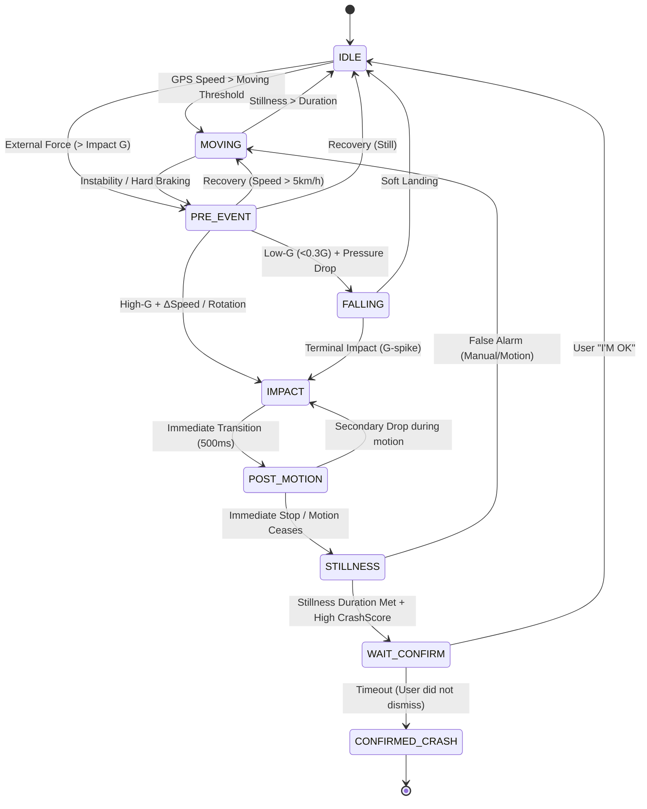

# Watch² Out ⌚⚡ (Watch Watch Out)

**Watch² Out** is a robust, safety-critical accident detection system for **Wear OS**, inspired by high-end crash detection algorithms. It monitors for **Vehicle Crashes (High-G)** and **Human Falls (Low-G)** in real-time.
However, this is an experimental attempt. **NEVER TRUST** this app for real safety.

## 🚀 Recent Core Enhancements (v1.3 / FSM v27.6)

### 🛡️ Enhanced Crash Inference (v27.6)
Implemented a sophisticated multi-stage State Machine (FSM) to analyze the physics of an accident:
*   **Universal Gateway (`PRE_EVENT`)**: Monitors both stationary and moving states, enabling detection of parked impacts and pedestrian-vehicle collisions.
*   **Physics-Based Segregation**: Distinct logic for **Impacts (High-G)**, **Free-Falls (Low-G)**, and **Post-Impact Motion (Rolling)**.
*   **Coherent Peak Analysis**: Captures a unified sensor snapshot at the exact moment of peak severity (`CrashScore`), providing reliable data for post-incident review.

### 📈 Historical Telemetry (v27.4)
*   **High-Res Batching**: Continuous 1Hz logging of all motion vectors (Accel, Gyro, Mag, Baro) to local Wear storage.
*   **Smart Sync**: Automatically batches logs every 60 seconds and performs an optimized background upload to the Mobile Companion every 1–2 hours.

### ⌚ Watch Face Integration
*   **Dynamic Complications**: Real-time system status icons integrated into Wear OS watch faces.
    *   **🛡️ Shield**: System active and monitoring.
    *   **⚡ Lightning**: Incident detected / Waiting for confirmation.
    *   **⚠️ Warning**: Sensor error or permission required.

### 🔋 Adaptive Sampling
*   **Speed-Aware Frequency**: Automatically scales from **2Hz** (stationary) up to **20Hz** (high-speed) based on GPS velocity to balance battery life and accident precision.

## Vehicle Incident State Machine (FSM v27.6)

## Core Features

### ⌚ Wear OS Sentinel (`:wear`)
*   **Automated Diagnostics**: Self-detects GPS, Mic, and Telephony capabilities.
*   **EDR (Blackbox)**: Persistent recording of 10s audio and high-fidelity sensor data in `/Download/watch2out`.
*   **Survival Logic**: Redundant alert dispatching through both local LTE and mobile relay.

### 📱 Mobile Companion (`:app`)
*   **Sentinel Hub**: Real-time remote monitoring of watch state and sensor health.
*   **Advanced Analytics**: Coherent peak data tracking and windowed trend analysis.
*   **Remote Control**: Trigger simulations and manage configuration presets.

## License
MIT License. See [LICENSE](LICENSE) for details.
