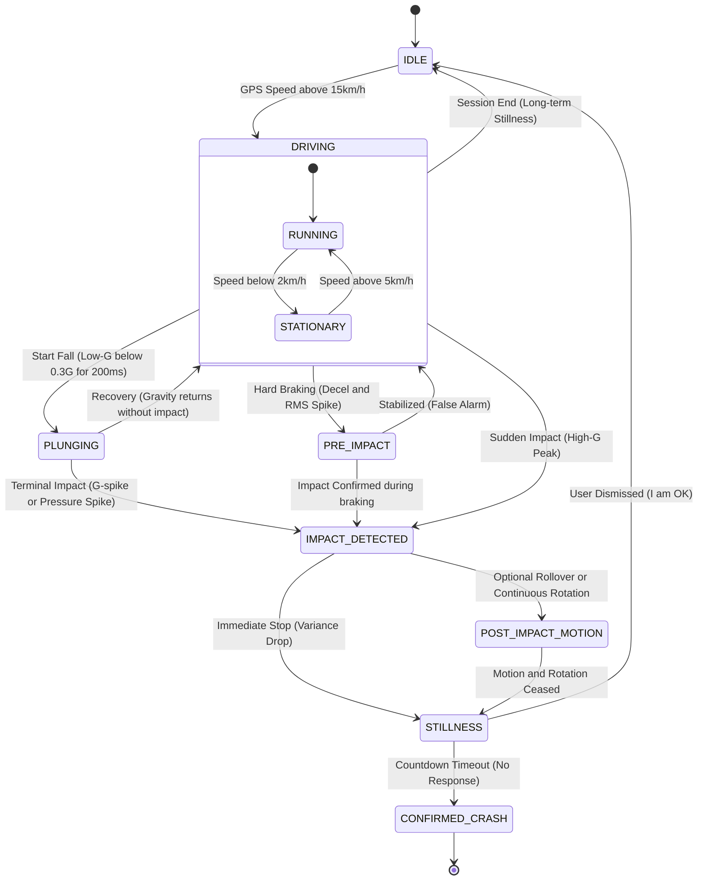

# Watch² Out ⌚⚡ (Watch Watch Out)

**Watch² Out** is a robust, safety-critical accident detection system for **Wear OS**, inspired by high-end crash detection algorithms. It monitors for **Vehicle Crashes (High-G)** and **Human Falls (Low-G)** in real-time.
However, This is just an experimental attempt like a toy app. **NEVER TRUST** this app for real safety.

## 🚀 Recent Core Enhancements

### 🛡️ Fail-Safe Emergency Protocol
*   **Dual-Device Dispatch:** Redundant alerting where both Watch and Phone independently manage timers and dispatching to ensure delivery even if one device is destroyed.
*   **15s/7s Alert Window:** A strictly timed sequence (15s loud alert -> 7s fail-safe cancellation window) that defaults to "Dispatch" if the user is unresponsive.
*   **3-Way Handshake Sync:** Robust cross-device synchronization using Request-Execute-Ack protocol to ensure "Dismiss" actions are consistent across both devices.

### 📸 Gold-Time Data Capture
*   **Impact Snapshot:** Captures precise GPS coordinates, technical force (G), and speed at the exact millisecond of impact, not when the alert is triggered.
*   **EDR Summary:** Generates a 10-second technical timeline of the lead-up to the impact, included in automated emergency reports.

### 📶 Robust Connectivity & Location
*   **Multi-Source Location:** Combined GPS + Network (WPS) providers with Last-Known-Location fallback to ensure coordinates are available even indoors.
*   **Reliable Retries:** Automated dispatch retries (up to 3 times) with staggered intervals (5s, 10s, 15s) to overcome transient network failures.

## Key Features

### ⌚ Wear OS Sentinel (`:wear`)

*   **Sentinel Architecture:** A persistent, high-resilience background service (`SentinelService`) with `START_STICKY` and Guardian-pattern recovery.
*   **FSM-based Detection:** State-machine based inference to distinguish between normal driving, pre-impact braking, and various crash types.
*   **Dynamic EDR (Blackbox):** Continuously buffers 10 seconds of high-fidelity sensor data.
*   **Audio Evidence:** Automatically records 10 seconds of ambient audio upon incident detection (Real events only).
*   **Direct Dispatch:** Standalone SMS capability for LTE-enabled watches when phone link is unavailable.

### 📱 Mobile Companion (`:app`)

*   **Configuration Hub:** Centralized management for auto-start policies, direct dispatch toggles, and emergency contacts.
*   **Multi-Channel Relay:** Primary gateway for sending detailed emergency Emails and SMS messages.
*   **Real-time Telemetry:** Streams live sensor data to high-resolution charts for testing and calibration.

## Vehicle Crash Inference State Machine

## License

MIT License. See [LICENSE](LICENSE) for details.
