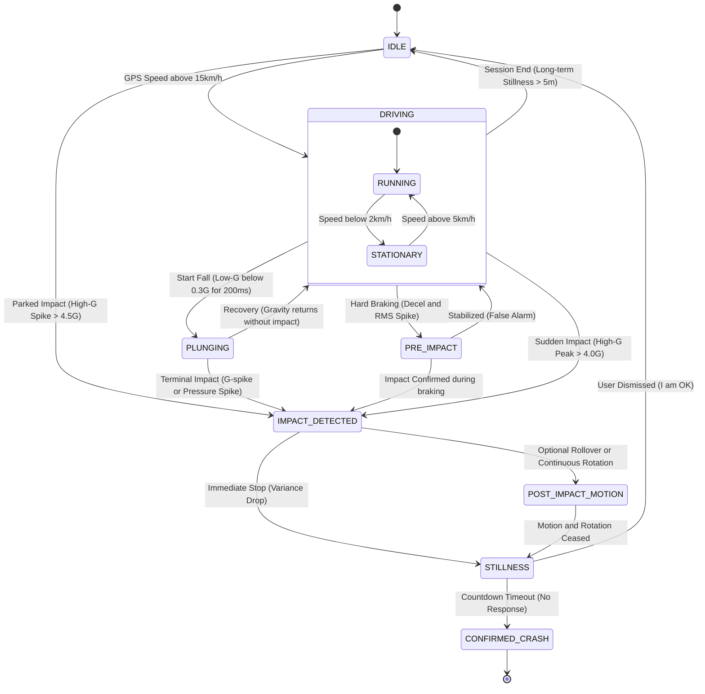

# Watch² Out ⌚⚡ (Watch Watch Out)

**Watch² Out** is a robust, safety-critical accident detection system for **Wear OS**, inspired by high-end crash detection algorithms. It monitors for **Vehicle Crashes (High-G)** and **Human Falls (Low-G)** in real-time.
However, This is just an experimental attempt like a toy app. **NEVER TRUST** this app for real safety.

## 🚀 Recent Core Enhancements (v1.1)

### 🛡️ Fail-Safe Emergency Protocol
*   **Dual-Device Dispatch:** Redundant alerting where both Watch and Phone independently manage timers and dispatching to ensure delivery even if one device is destroyed.
*   **15s/7s Alert Window:** A strictly timed sequence (15s loud alert -> 7s fail-safe cancellation window) that defaults to "Dispatch" if the user is unresponsive.
*   **Synchronized Cancellation:** Real-time "I'M OK" sync via `STATUS_SYNC` ensuring both devices dismiss the alert simultaneously.

### 📊 Adaptive Sensing & Analytics
*   **Dynamic Sampling:** Automatically adjusts sensor rates (100ms/200ms/400ms) based on GPS speed to maximize battery life while maintaining precision during high-speed travel.
*   **Refined EDR:** Energy-based `RollSum` for rollover detection and color-coded `CrashScore` for real-time impact analysis.
*   **Impact Snapshot:** Captures precise GPS, G-force, and speed at the exact millisecond of impact.

### 📶 Robust Connectivity & Location
*   **Multi-Source Location:** Combined GPS + Network (WPS) providers with Last-Known-Location fallback.
*   **Reliable Retries:** Automated dispatch retries (up to 3 times) with staggered intervals.

## Key Features

### ⌚ Wear OS Sentinel (`:wear`)
*   **Sentinel Architecture:** Persistent background service (`SentinelService`) with `START_STICKY` recovery.
*   **Parked Impact Detection:** Monitors for high-G events even when the vehicle is stationary (IDLE state).
*   **Dynamic EDR (Blackbox):** Continuously buffers 10 seconds of high-fidelity sensor data.
*   **Direct Dispatch:** Standalone SMS capability for LTE-enabled watches.

### 📱 Mobile Companion (`:app`)
*   **Configuration Hub:** Centralized management for auto-start policies and emergency contacts.
*   **Analytics Hub:** High-fidelity dashboard showing live charts, lifetime peaks, and windowed peak analysis.

## Vehicle Crash Inference State Machine (FSM)

## License
MIT License. See [LICENSE](LICENSE) for details.
