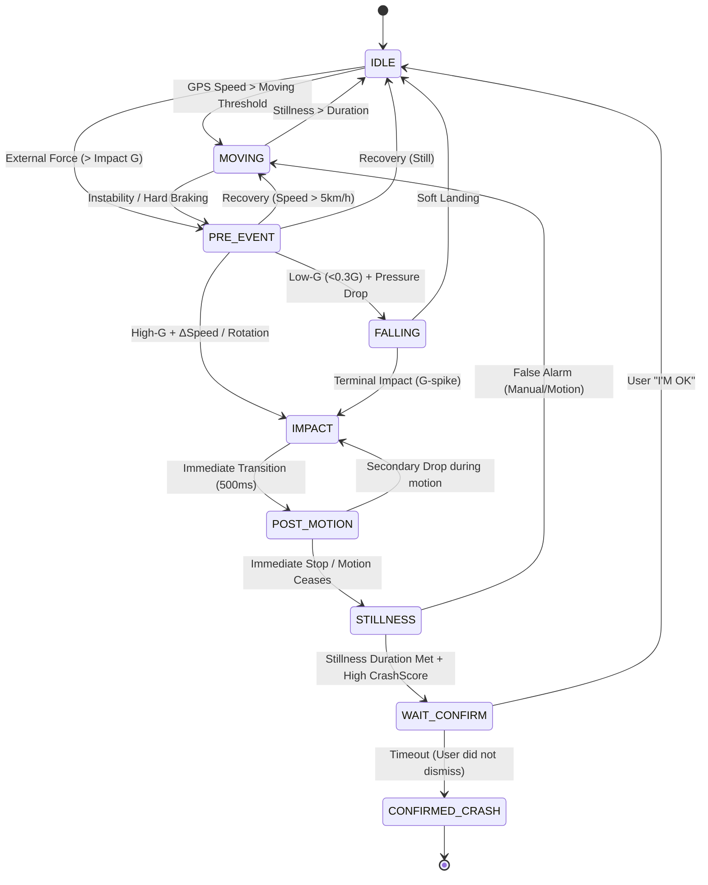

# Watch² Out ⌚⚡ (Watch Watch Out)

**Watch² Out** is a robust, safety-critical accident detection system for **Wear OS**, inspired by high-end crash detection algorithms. It monitors for **Vehicle Crashes (High-G)** and **Human Falls (Low-G)** in real-time.
However, this is an experimental attempt. **NEVER TRUST** this app for real safety.

## 🚀 Recent Core Enhancements (v1.2 / FSM v34.0)

### 🛡️ High-Reliability Alerts (v34.0)
*   **Android 14+ BAL Bypass**: Implemented a robust alert mechanism using a dedicated `AlertReceiver` and **Full-Screen Intent (FSI)** notifications to reliably bypass Background Activity Launch restrictions on modern Android versions.
*   **Persistent Fail-Safe Vibration**: Added a continuous, high-intensity repeating vibration pattern that starts at the moment of detection and persists until the user interacts with the alert UI.
*   **Aggressive Screen Wake**: Integrated `KeyguardManager` logic to force wake the screen and dismiss the lockscreen overlay, ensuring the critical alert is immediately visible.

### 🔋 Startup & Performance Optimization (v33.3)
*   **Zero-Lag Startup**: Resolved UI thread hangs (`Davey` logs) by staggering hardware sensor registration with micro-delays and implementing a background **Serialization Warm-up** engine.
*   **Streamlined Telemetry**: Optimized the `TelemetryState` data model by removing redundant debugging fields, resulting in faster serialization and lower communication latency between the Watch and Phone.
*   **Delayed Initial Sync**: Postponed the first data handshake by 3 seconds after boot to ensure the system is fully stabilized before starting heavy network activity.

### 🗺️ Hybrid GPS Fusion Toggle (v34.2)
*   **Configurable Fusion**: Added a user-controllable option to enable or disable **Phone GPS integration**.
*   **Passive Battery Saver**: When Phone GPS is disabled, the mobile app automatically switches to a low-frequency (15-min) "passive" update mode to maintain a backup emergency location without draining the battery.
*   **Unified UI Status**: Standardized GPS status labels ("WATCH ONLY", "WATCH HYBRID", "WATCH NET ONLY") across all screens for absolute clarity on the active tracking source.

### 🛡️ Fail-Safe Data Delivery (v32.0)
*   **Disk-Based Persistence**: Critical EDR reports and audio evidence are now automatically saved to a local "Fail-Safe Store" if immediate transfer to the phone fails.
*   **Background Retry Engine**: A dedicated service periodically re-attempts transfers every 5 minutes and upon reconnection, ensuring 100% reliability for important incident data.
*   **Optimized Transfer Flow**: Decoupled EDR from Audio. The full JSON report is sent **instantly** when an alert starts, while the audio follows as secondary evidence.

### 🛡️ Robust FSM with Memory (v32.0)
*   **Peak-Score Memory**: The State Machine now "remembers" the maximum severity reached during a tumble or rollover, ensuring the alert triggers correctly once the vehicle reaches stillness.
*   **Hysteresis Latching**: Added stability logic to the `PRE_EVENT` state to prevent "state bounce" during complex multi-impact scenarios.
*   **Centralized Logic**: Detection physics are now unified in the `:shared` module, guaranteeing identical behavior across all deployment platforms.

### 🚨 High-Intensity Alerting
*   **Visual Warning**: Upgraded to a high-contrast **Pure Red** blinking UI for maximum visibility in stressful situations.
*   **Haptic Feedback**: Replaced standard vibration with an aggressive **double-pulse pattern** that repeats throughout the countdown window.

### 📁 Advanced EDR Formatting
*   **Readable Timestamps**: Added dual-format timestamps (`t` for machine math, `time` for human inspection) to every telemetry point: `CCYYMMDD-HH:MM:SS:MSEC`.
*   **Pretty Printing**: All JSON logs are now exported with indentation and whitespace for professional readability.
*   **Synchronized Evidence**: Audio recordings share exact timestamps with sensor data files for easy correlation.

### 🛡️ Crash-Recovery & Survival (v28.6.5)
*   **Self-Healing "Guardian"**: Added background logic to automatically resume monitoring if the `SentinelService` is killed by the system.
*   **State Persistence**: Operational state is now mirrored in `DataStore`, surviving process crashes and device reboots.
*   **System Integration**: Implemented `BOOT_COMPLETED` receiver for zero-touch auto-start upon device power-on.

### 📈 Manual Telemetry Pull (v28.6)
*   **On-Demand Sync**: Users can now force an immediate upload of all pending telemetry logs from the Watch to the Phone via "Pull-to-Refresh" on the mobile dashboard.
*   **Reliable Transport**: Optimized the `NodeClient` resolution to prevent `TARGET_NODE_NOT_CONNECTED` errors during manual sync events.

### 🛡️ Enhanced Crash Inference (v27.6)
Implemented a sophisticated multi-stage State Machine (FSM) to analyze the physics of an accident:
*   **Universal Gateway (`PRE_EVENT`)**: Monitors both stationary and moving states, enabling detection of parked impacts and pedestrian-vehicle collisions.
*   **Physics-Based Segregation**: Distinct logic for **Impacts (High-G)**, **Free-Falls (Low-G)**, and **Post-Impact Motion (Rolling)**.
*   **Coherent Peak Analysis**: Captures a unified sensor snapshot at the exact moment of peak severity (`CrashScore`), providing reliable data for post-incident review.

### 📈 Historical Telemetry (v27.4)
*   **High-Res Batching**: Continuous 1Hz logging of all motion vectors (Accel, Gyro, Mag, Baro) to local Wear storage.
*   **Smart Sync**: Automatically batches logs every 60 seconds and performs an optimized background upload to the Mobile Companion every 1–2 hours.

### ⌚ Watch Face Integration
*   **Dynamic Complications**: Real-time system status icons integrated into Wear OS watch faces.
    *   **🛡️ Shield**: System active and monitoring.
    *   **⚡ Lightning**: Incident detected / Waiting for confirmation.
    *   **⚠️ Warning**: Sensor error or permission required.

### 🔋 Adaptive Sampling
*   **Speed-Aware Frequency**: Automatically scales from **2Hz** (stationary) up to **20Hz** (high-speed) based on GPS velocity to balance battery life and accident precision.

## Vehicle Incident State Machine (FSM v27.6)

## Core Features

### ⌚ Wear OS Sentinel (`:wear`)
*   **Automated Diagnostics**: Self-detects GPS, Mic, and Telephony capabilities.
*   **EDR (Blackbox)**: Persistent recording of 25s audio (15s alarm + 10s post-event) and high-fidelity sensor data.
*   **Survival Logic**: Redundant alert dispatching through both local LTE and mobile relay.
*   **Indicator**: A(Accelerometer), G(Gyroscope), P(Pressure), R(Rotation Vector), L(Location/GPS), M(Microphone), T(Telephony/SMS)

### 📱 Mobile Companion (`:app`)
*   **Sentinel Hub**: Real-time remote monitoring of watch state and sensor health.
*   **Advanced Analytics**: Coherent peak data tracking and windowed trend analysis.
*   **Remote Control**: Trigger simulations and manage configuration presets.

## License
MIT License. See [LICENSE](LICENSE) for details.
